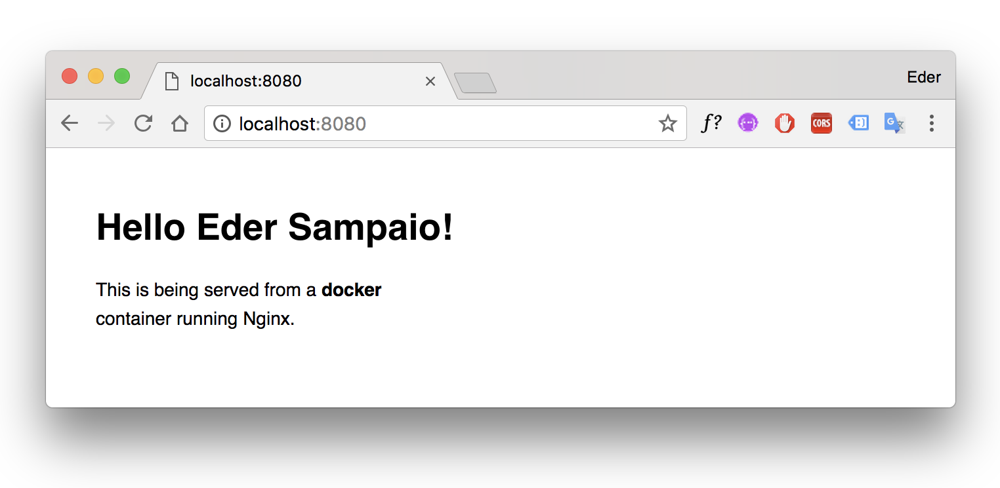
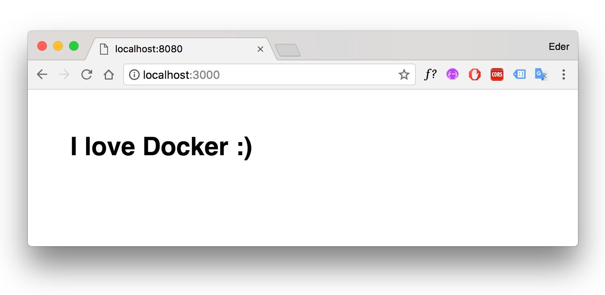

# Docker quick  commands


## Get Started

For more informations [access the official documentation](https://docs.docker.com/get-started/).

## Installation

- [Install Docker for Mac](https://docs.docker.com/docker-for-mac/install/)
- [Get Docker CE for Ubuntu](https://docs.docker.com/install/linux/docker-ce/ubuntu/)
- [Install Docker for Windows](https://docs.docker.com/docker-for-windows/install/)

### Test Docker version

Run `docker --version` and ensure that you have a supported version of Docker:

```bash
$ docker --version
Docker version 18.03.1-ce, build 9ee9f40
```

### Test Docker installation

```bash
$ docker run hello-world

Unable to find image 'hello-world:latest' locally
latest: Pulling from library/hello-world
ca4f61b1923c: Pull complete
Digest: sha256:ca0eeb6fb05351dfc8759c20733c91def84cb8007aa89a5bf606bc8b315b9fc7
Status: Downloaded newer image for hello-world:latest

Hello from Docker!
This message shows that your installation appears to be working correctly.
...
```

## Commands

### Create a new container

```bash
$ docker run ubuntu
```

### List active containers

```bash
$ docker ps
```

### List all containers

```bash
$ docker ps -a
```

### Only display numeric IDs `-q, --quiet`

```bash
$ docker ps -q
```

### Create a new container and active interative terminal

```bash
$ docker run -it ubuntu
```

*<small>For exit the terminal press `Ctrl` + `d`.</small>*

### Start an container

```bash
$ docker start CONTAINER_ID
```

##### Start an container with interative terminal

```bash
$ docker start -a -i CONTAINER_ID
```

### Stop an container

```bash
$ docker stop CONTAINER_ID
```

Seconds to wait for stop before killing it (default 10) `-t, --time int`

```bash
$ docker stop -t 0 CONTAINER_ID
```

### Stop all active container

```bash
$ docker stop -t 0 $(docker ps -q)
```

### Remove container

```bash
$ docker rm CONTAINER_ID
```

### Remove all inactive containers

```bash
$ docker container prune
```

### List all images

```bash
$ docker images
```

### Remove image

```bash
$ docker rmi REPOSITORY_NAME
```

### Remove all images

```bash
$ docker rmi $(docker images -q)
```

### Run container in background and print container ID `--detach option`

```bash
docker run -d dockersamples/static-site
```

#### Publish all exposed ports to random ports `-P, --publish-all`

```bash
$ docker run -d -P dockersamples/static-site
$ docker port CONTAINER_ID

443/tcp -> 0.0.0.0:32768
80/tcp -> 0.0.0.0:32769
```

*<small>**Note:** `0.0.0.0:32768` = `localhost:32768`.</small>*

#### Publish a container's port(s) to the host `-p, --publish list`


```bash
$ docker run -d -p 8080:80 --name site-sample dockersamples/static-site
$ docker port 08e0b419d760

80/tcp -> 0.0.0.0:8080
```
*<small>**Note:** `8080` port my machine and `80` port of container</small>.*

### Assign a name to the container `--name string`.

```bash
$ docker run -d -P --name site-sample dockersamples/static-site
$ docker ps

CONTAINER ID        IMAGE                       COMMAND                  CREATED              STATUS              PORTS                                           NAMES
5c86c9424798        dockersamples/static-site   "/bin/sh -c 'cd /usr…"   About a minute ago   Up About a minute   0.0.0.0:32771->80/tcp, 0.0.0.0:32770->443/tcp   site-sample
```

## Set environment variables `-e, --env list`

```bash
$ docker run -d -p 8080:80 -e AUTHOR="Eder Sampaio" dockersamples/static-site
```

Open [`http://localhost:8080`](http://localhost:8080) in the browser:



## Bind mount a volume `-v, --volume list`

```bash
$ docker run -it -v "/Users/edersampaio/docker-sample:/var/www" ubuntu
```

Keeps folders and files created in `/var/www`, same after remove container.

## Run container and modify files locally

```bash
$ docker run -it -p 3000:3000 -v "/Users/edersampaio/docker-node-sample:/var/www" -w "/var/www" node:9.11.1-alpine npm start

# or

$ cd /Users/edersampaio/docker-node-sample
$ docker run -it -p 3000:3000 -v "$(pwd):/var/www" -w "/var/www" node:9.11.1-alpine npm start
```



## Dockerfile

### Create a Dockerfile

```dockerfile
# image
FROM node:9.11.1-alpine

# maintainer
LABEL maintainer="edersampaio@outlook.com.br"

# copy files
COPY . /var/www

# working directory
WORKDIR /var/www

# install node dependencies and start server
RUN npm install
ENTRYPOINT [ "npm", "start" ]

# export port
EXPOSE 3000
```

#### Dockerfile with Node Enviroments
```dockerfile
# image
FROM node:9.11.1-alpine

# maintainer
LABEL maintainer="edersampaio@outlook.com.br"

# node envs
ENV NODE_ENV=production
ENV PORT=3000

# copy files
COPY . /var/www

# working directory
WORKDIR /var/www

# install node dependencies and start server
RUN npm install
ENTRYPOINT [ "npm", "start" ]

# export port
EXPOSE $PORT
```

### Create image

```bash
$ docker build -f Dockerfile -t ederssouza/node-alpine .

# or

$ docker build -t ederssouza/node-alpine .
```

### Run container

```bash
$ docker run -d -p 8080:3000 ederssouza/node-alpine
```

## Docker Hub

### Publishing your image on Docker Hub

```bash
# entry with your login and password
$ docker login
Login Succeeded

$ docker push ederssouza/node-alpine
```


### Downloading image of Docker Hub

```bash
$ docker pull ederssouza/node-alpine
```

## Docker networking